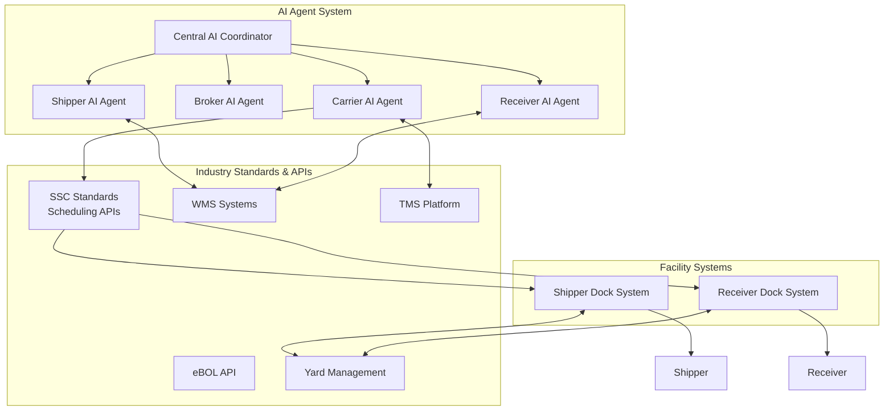

```mermaid
flowchart TB
    subgraph AI ["AI Agent System"]
        direction TB
        Central[Central AI Coordinator]
        ShipperAI[Shipper AI Agent]
        BrokerAI[Broker AI Agent]
        CarrierAI[Carrier AI Agent]
        ReceiverAI[Receiver AI Agent]
       
        Central --> ShipperAI & BrokerAI & CarrierAI & ReceiverAI
    end

    subgraph APIs ["Industry Standards & APIs"]
        SSC[SSC Standards\nScheduling APIs]
        eBOL[eBOL API]
        WMS[WMS Systems]
        TMS[TMS Platform]
        YMS[Yard Management]
    end

    subgraph Facilities ["Facility Systems"]
        ShipperDock[Shipper Dock System]
        ReceiverDock[Receiver Dock System]
    end

    %% SSC Standard Implementation
    CarrierAI --> SSC
    SSC --> ShipperDock
    SSC --> ReceiverDock
   
    %% Facility Connections
    ShipperDock --> Shipper
    ReceiverDock --> Receiver
   
    %% Other System Integrations
    ShipperDock <--> YMS
    ReceiverDock <--> YMS
    CarrierAI <--> TMS
    ShipperAI <--> WMS
    ReceiverAI <--> WMS
```