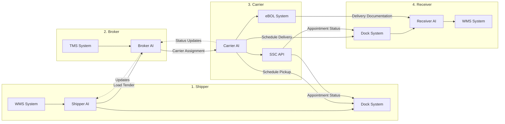

```mermaid
flowchart LR
    %% Shipper Section
    subgraph Shipper_Section ["1. Shipper"]
        ShipperWMS[WMS System]
        ShipperDock[Dock System]
        ShipperAI[Shipper AI]
        
        ShipperWMS --> ShipperAI
        ShipperAI --> ShipperDock
    end

    %% Broker Section
    subgraph Broker_Section ["2. Broker"]
        BrokerTMS[TMS System]
        BrokerAI[Broker AI]
        
        BrokerTMS --> BrokerAI
    end

    %% Carrier Section
    subgraph Carrier_Section ["3. Carrier"]
        CarrierAI[Carrier AI]
        SSC[SSC API]
        eBOL[eBOL System]
        
        CarrierAI --> SSC
        CarrierAI --> eBOL
    end

    %% Receiver Section
    subgraph Receiver_Section ["4. Receiver"]
        ReceiverDock[Dock System]
        ReceiverWMS[WMS System]
        ReceiverAI[Receiver AI]
        
        ReceiverDock --> ReceiverAI
        ReceiverAI --> ReceiverWMS
    end

    %% Workflow Connections
    ShipperAI -->|Load Tender| BrokerAI
    BrokerAI -->|Carrier Assignment| CarrierAI
    CarrierAI -->|Schedule Pickup| ShipperDock
    CarrierAI -->|Schedule Delivery| ReceiverDock
    SSC -->|Appointment Status| ShipperDock
    SSC -->|Appointment Status| ReceiverDock
    eBOL -->|Delivery Documentation| ReceiverAI

    %% Optional status updates
    CarrierAI -.->|Status Updates| BrokerAI
    BrokerAI -.->|Updates| ShipperAI
```